<a href="https://www.gotoiot.com/">
    
</a>

Web App Full Stack Base
=======================

*Ayudaría mucho si apoyaras este proyecto con una ⭐ en Github!*

Este proyecto es una aplicación web fullstack que se ejecuta sobre el ecosistema `Docker`. Está compuesta por un compilador de `TypeScript` que te permite utilizar este superset de JavaScript para poder programar un `cliente web`. También tiene un servicio en `NodeJS` que te permite ejecutar código en backend y al mismo tiempo disponibilizar el código del cliente web para interactar con el servicio. Además tiene una `base de datos` MySQL que puede interactuar con el backend para guardar y consultar datos, y de manera adicional trae un `administrador` de base de datos para poder administrar la base en caso que lo necesites.

La aplicación IoT de base que viene con este proyecto se encarga de crear una tabla llamada `Devices` en la base de datos, y la idea es que vos puedas desarrollar el código de backend y frontend que te permita controlar desde el navegador el estado de los devices de un hogar inteligente - *como pueden ser luces, TVs, ventiladores, persianas, enchufes y otros* - y almacenar los estados de cada uno en la base de datos. 

Realizando estas tareas vas a a tener una aplicación fullstack IoT del mundo real que utiliza tecnologías actuales en la que un backend es capaz de interactuar con una DB para cumplir con las peticiones de control que se le mandan desde el cliente web.

En esta imagen podés ver una posible implementación del cliente web que controla los artefactos del hogar.

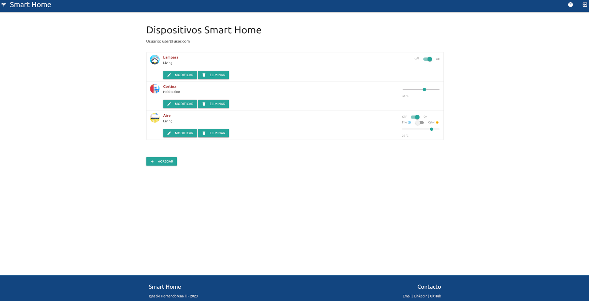

## Comenzando 🚀

Esta sección es una guía con los pasos escenciales para que puedas poner en marcha la aplicación.

<details><summary><b>Mira los pasos necesarios</b></summary><br>

### Instalar las dependencias

Para correr este proyecto es necesario que instales `Docker` y `Docker Compose`. 

En [este artículo](https://www.gotoiot.com/pages/articles/docker_installation_linux/) publicado en nuestra web están los detalles para instalar Docker y Docker Compose en una máquina Linux. Si querés instalar ambas herramientas en una Raspberry Pi podés seguir [este artículo](https://www.gotoiot.com/pages/articles/rpi_docker_installation) de nuestra web que te muestra todos los pasos necesarios.

En caso que quieras instalar las herramientas en otra plataforma o tengas algún incoveniente, podes leer la documentación oficial de [Docker](https://docs.docker.com/get-docker/) y también la de [Docker Compose](https://docs.docker.com/compose/install/).

Continua con la descarga del código cuando tengas las dependencias instaladas y funcionando.

### Descargar el código

Para descargar el código, lo más conveniente es que realices un `fork` de este proyecto a tu cuenta personal haciendo click en [este link](https://github.com/gotoiot/app-fullstack-base/fork). Una vez que ya tengas el fork a tu cuenta, descargalo con este comando (acordate de poner tu usuario en el link):

```
git clone https://github.com/USER/app-fullstack-base.git
```

> En caso que no tengas una cuenta en Github podes clonar directamente este repo.

### Ejecutar la aplicación

Para ejecutar la aplicación tenes que correr el comando `docker-compose up` desde la raíz del proyecto. Este comando va a descargar las imágenes de Docker de node, de typescript, de la base datos y del admin de la DB, y luego ponerlas en funcionamiento. 

Para acceder al cliente web ingresa a a la URL [http://localhost:8000/](http://localhost:8000/) y para acceder al admin de la DB accedé a [localhost:8001/](http://localhost:8001/). 

Si pudiste acceder al cliente web y al administrador significa que la aplicación se encuentra corriendo bien. 

> Si te aparece un error la primera vez que corres la app, deteńe el proceso y volvé a iniciarla. Esto es debido a que el backend espera que la DB esté creada al iniciar, y en la primera ejecución puede no alcanzar a crearse. A partir de la segunda vez el problema queda solucionado.

</details>

Continuá explorando el proyecto una vez que lo tengas funcionando.

## Configuraciones de funcionamiento 🔩

Al crearse la aplicación se ejecutan los contenedores de Docker de cada servicio, se crea la base de datos y sus tablas. A continuación podés encontrar info si querés cambiar la estructura de la DB o bien sus configuraciones de acceso.

<details><summary><b>Lee cómo configurar la aplicación</b></summary><br>

### Configuración de la DB

Como ya comprobaste, para acceder PHPMyAdmin tenés que ingresar en la URL [localhost:8001/](http://localhost:8001/). En el login del administrador, el usuario para acceder a la db es `root` y contraseña es la variable `MYSQL_ROOT_PASSWORD` del archivo `docker-compose.yml`.

Para el caso del servicio de NodeJS que se comunica con la DB fijate que en el archivo `src/backend/mysql-connector.js` están los datos de acceso para ingresar a la base.

Si quisieras cambiar la contraseña, puertos, hostname u otras configuraciones de la DB deberías primero modificar el servicio de la DB en el archivo `docker-compose.yml` y luego actualizar las configuraciones para acceder desde PHPMyAdmin y el servicio de NodeJS.

### Estructura de la DB

Al iniciar el servicio de la base de datos, si esta no está creada toma el archivo que se encuentra en `db/dumps/smart_home.sql` para crear la base de datos automáticamente.

En ese archivo está la configuración de la tabla `Devices` y otras configuraciones más. Si quisieras cambiar algunas configuraciones deberías modificar este archivo y crear nuevamente la base de datos para que se tomen en cuenta los cambios.

Tené en cuenta que la base de datos se crea con permisos de superusuario por lo que no podrías borrar el directorio con tu usuario de sistema, para eso debés hacerlo con permisos de administrador. En ese caso podés ejecutar el comando `sudo rm -r db/data` para borrar el directorio completo.

</details>


## Detalles principales 🔍

En esta sección vas a encontrar las características más relevantes del proyecto.

<details><summary><b>Mira los detalles más importantes de la aplicación</b></summary><br>
<br>

### Arquitectura de la aplicación

Como ya pudiste ver, la aplicación se ejecuta sobre el ecosistema Docker, y en esta imagen podés ver el diagrama de arquitectura.


### El cliente web

El cliente web es una Single Page Application que se comunica con el servicio en NodeJS mediante JSON a través de requests HTTP. Puede consultar el estado de dispositivos en la base de datos (por medio del servicio en NodeJS) y también cambiar el estado de los mismos. Los estilos del código están basados en **Material Design**.

### El servicio web

El servicio en **NodeJS** posee distintos endpoints para comunicarse con el cliente web mediante requests HTTP enviando **JSON** en cada transacción. Procesando estos requests es capaz de comunicarse con la base de datos para consultar y controlar el estado de los dispositivos, y devolverle una respuesta al cliente web también en formato JSON. Así mismo el servicio es capaz de servir el código del cliente web.

### La base de datos

La base de datos se comunica con el servicio de NodeJS y permite almacenar el estado de los dispositivos en la tabla **Devices**. Ejecuta un motor **MySQL versión 5.7** y permite que la comunicación con sus clientes pueda realizarse usando usuario y contraseña en texto plano. En versiones posteriores es necesario brindar claves de acceso, por este motivo la versión 5.7 es bastante utilizada para fases de desarrollo.

### El administrador de la DB

Para esta aplicación se usa **PHPMyAdmin**, que es un administrador de base de datos web muy utilizado y que podés utilizar en caso que quieras realizar operaciones con la base, como crear tablas, modificar columnas, hacer consultas y otras cosas más.

### El compilador de TypeScript

**TypeScript** es un lenguaje de programación libre y de código abierto desarrollado y mantenido por Microsoft. Es un superconjunto de JavaScript, que esencialmente añade tipos estáticos y objetos basados en clases. Para esta aplicación se usa un compilador de TypeScript basado en una imagen de [Harmish](https://hub.docker.com/r/harmish) en Dockerhub, y está configurado para monitorear en tiempo real los cambios que se realizan sobre el directorio **src/frontend/ts** y automáticamente generar código compilado a JavaScript en el directorio  **src/frontend/js**. Los mensajes del compilador aparecen automáticamente en la terminal al ejecutar el comando **docker-compose up**.

### Ejecución de servicios

Los servicios de la aplicación se ejecutan sobre **contenedores de Docker**, así se pueden desplegar de igual manera en diferentes plataformas. Los detalles sobre cómo funcionan los servicios los podés ver directamente en el archivo **docker-compose.yml**.

### Organización del proyecto

En la siguiente ilustración podés ver cómo está organizado el proyecto para que tengas en claro qué cosas hay en cada lugar.

```sh
├── db                          # directorio de la DB
│   ├── data                    # estructura y datos de la DB
│   └── dumps                   # directorio de estructuras de la DB
│       └── smart_home.sql      # estructura con la base de datos "smart_home"
├── doc                         # documentacion general del proyecto
└── src                         # directorio codigo fuente
│   ├── backend                 # directorio para el backend de la aplicacion
│   │   ├── index.js            # codigo principal del backend
│   │   ├── mysql-connector.js  # codigo de conexion a la base de datos
│   │   ├── package.json        # configuracion de proyecto NodeJS
│   │   └── package-lock.json   # configuracion de proyecto NodeJS
│   └── frontend                # directorio para el frontend de la aplicacion
│       ├── js                  # codigo javascript que se compila automáticamente
│       ├── static              # donde alojan archivos de estilos, imagenes, fuentes, etc.
│       ├── ts                  # donde se encuentra el codigo TypeScript a desarrollar
│       └── index.html          # archivo principal del cliente HTML
├── docker-compose.yml          # archivo donde se aloja la configuracion completa
├── README.md                   # este archivo
├── CHANGELOG.md                # archivo para guardar los cambios del proyecto
├── LICENSE.md                  # licencia del proyecto
```

> No olvides ir poniendo tus cambios en el archivo `CHANGELOG.md` a medida que avanzas en el proyecto.

</details>

## Detalles de implementación 💻

En esta sección podés ver los detalles específicos de funcionamiento del código.

<details><summary><b>Mira los detalles de implementación</b></summary><br>

### Frontend 👨🏻‍💻

Este proyecto es una Single Page Application (SPA) basada en el template del repositorio de [mramos88](https://github.com/mramos88/app-fullstack-base-2023-i08). La aplicación ha sido modificada para permitir el alta, baja, modificación y control de dispositivos (de tres tipos: lamparas, cotinas y aires acondicionados), así como el inicio de sesión de usuarios mediante correo electrónico y contraseña.

La aplicación envía los estados de los dispositivos al servidor y los almacena en una base de datos cada vez que ocurre un cambio. Todos los datos relevantes de los dispositivos, como el ID, nombre, descripción, tipo y estado, también se almacenan en la base de datos.

Los usuarios pueden acceder a sus cuentas utilizando sus credenciales de inicio de sesión. Estos datos también se almacenan en la base de datos para su posterior autenticación.

La SPA proporciona una experiencia de usuario fluida y receptiva, permitiendo a los usuarios realizar todas las acciones necesarias para administrar los dispositivos.

¡Explora todas las funcionalidades que ofrece esta aplicación!

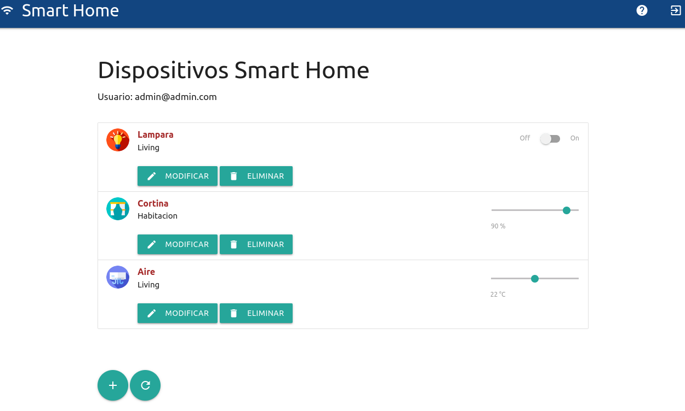

#### Inicio de sesión de usuarios 👥

Se ha implementado la opción de inicio de sesión utilizando el correo electrónico y la contraseña. En esta etapa, se han agregado dos usuarios para testing: el usuario número 1 es `admin@admin.com` con la contraseña `secreto`, y el segundo usuario es `user@user.com` con la contraseña `1234`. queda como mejora a implementar la funcionalidad de alta, baja y modificación de usuarios.

El correo electrónico del usuario con el que se ha iniciado sesión se muestra en la pantalla de dispositivos. Por el momento, al iniciar sesión con cualquiera de los usuarios, solo se muestran los dispositivos del usuario `admin@admin.com`:

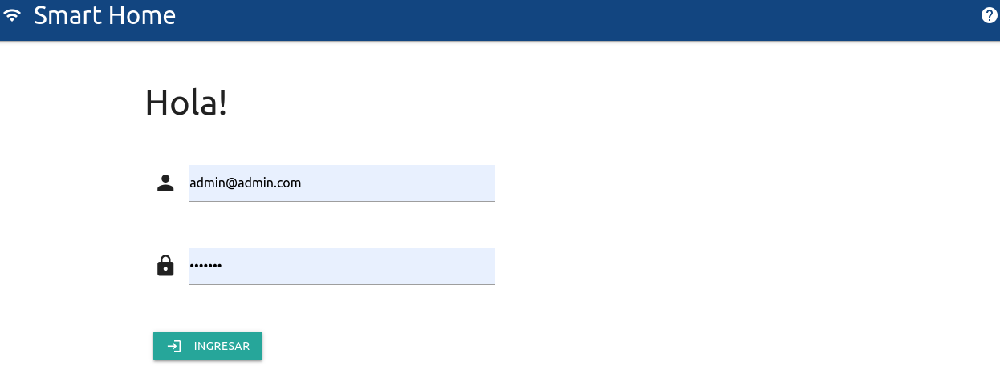

Si no se ingresa un mail, la aplicación informará de dicho error:

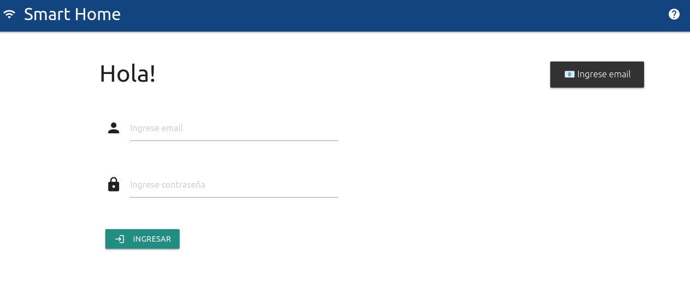

De misma manera si no se ingresa la contraseña:

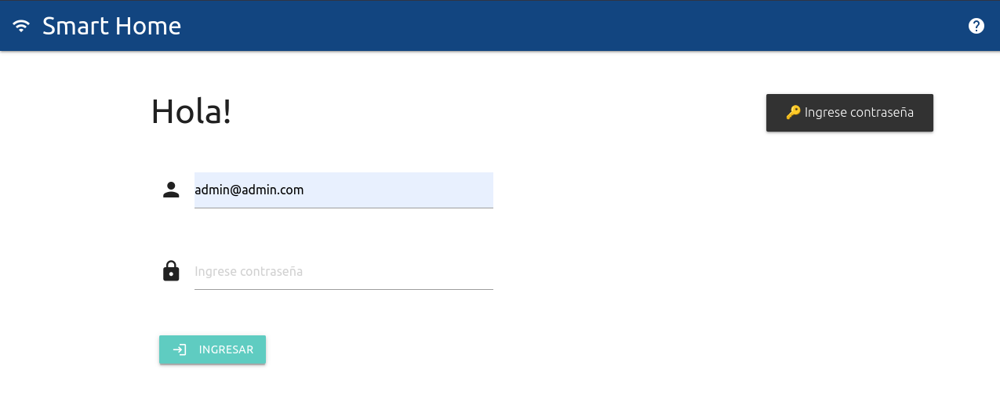

En el caso que las credenciales sea incorrectas se informará mediante un aviso:

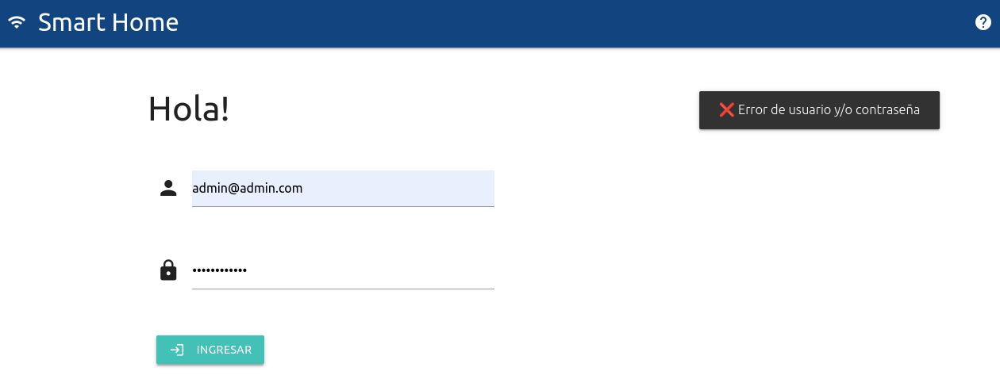

#### Agregar un dispositivo ➕

Para agregar un dispositivo, simplemente haz clic en el botón `+` en la parte inferior de la página y completa los datos del formulario. Luego, confirma la acción haciendo clic en el botón `Agregar` o `cancelar` si no deseas agregar un nuevo dispositivo. Puedes agregar tres tipos de dispositivos: Lampara (tipo de dispositivo 1), Cortina (tipo de dispositivo 2) y Aire (tipo de dispositivo 3).

- Lampara: Tiene un interruptor de encendido y apagado.
- Cortina: Tiene una barra deslizadora para ajustar el valor entre 0% y 100%, con intervalos de 10%.
- Aire Acondicionado: Tiene una barra deslizadora para ajustar la temperatura entre 16°C y 30°C, con intervalos de 1°C.

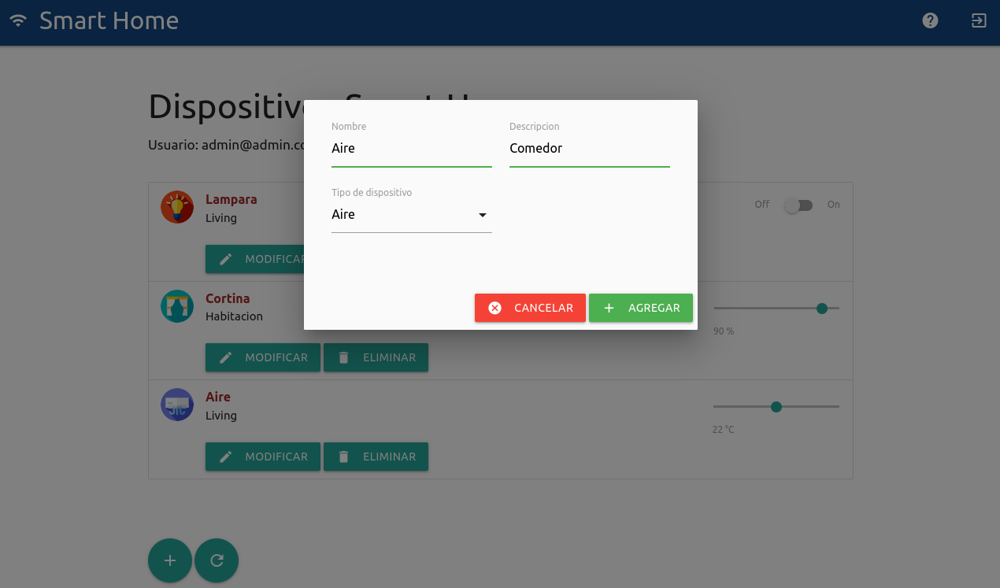

La aplicación confirmará que el dispositivo ha sido agregado:

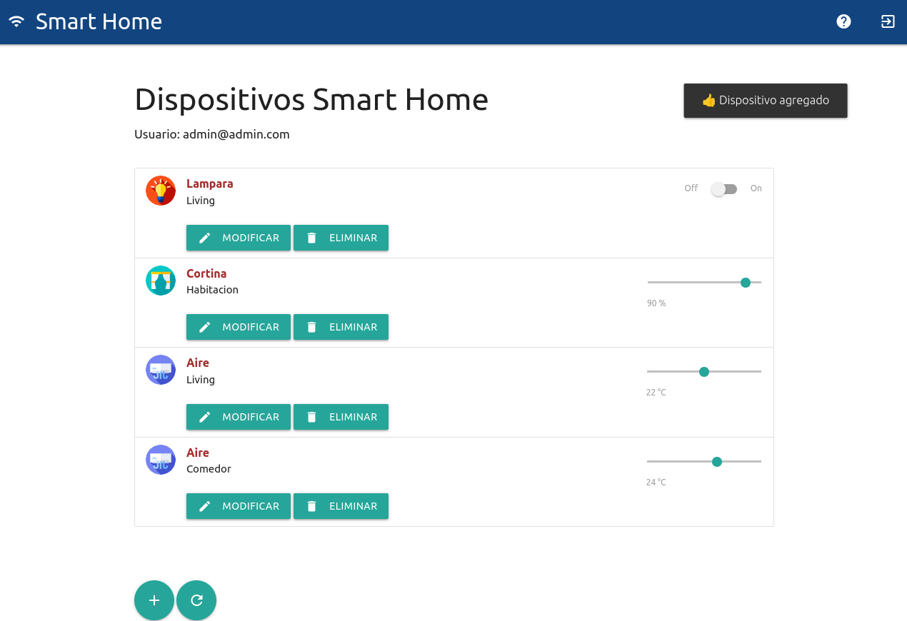

#### Eliminar un dispositivo 🗑️

En cada uno de los dispositivos listados, hay un botón `Eliminar`. Al hacer clic en él, se mostrará un menú para confirmar la acción:

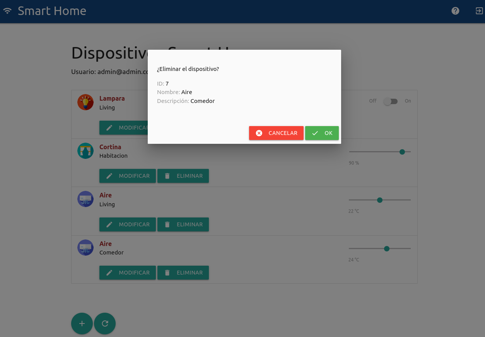

De manera similar al agregar dispositivos, recibirás una notificación informando que el dispositivo ha sido eliminado:

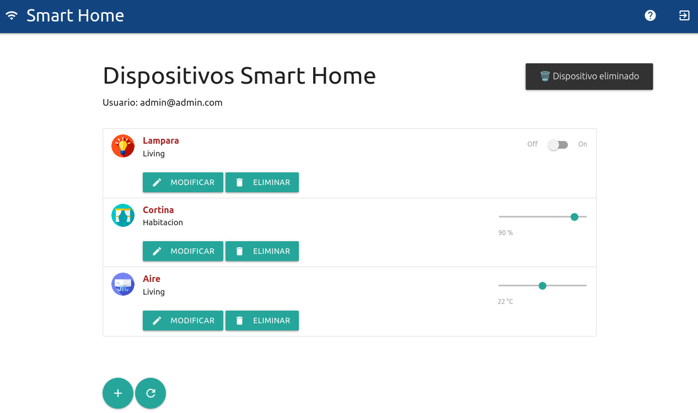

#### Modificar un dispositivo 📝

En cada uno de los dispositivos listados, hay un botón `Modificar`. Al hacer clic en él, se mostrará un menú para confirmar la acción. En esta instancia, podrás editar los mismos atributos que se solicitan al agregar un dispositivo:

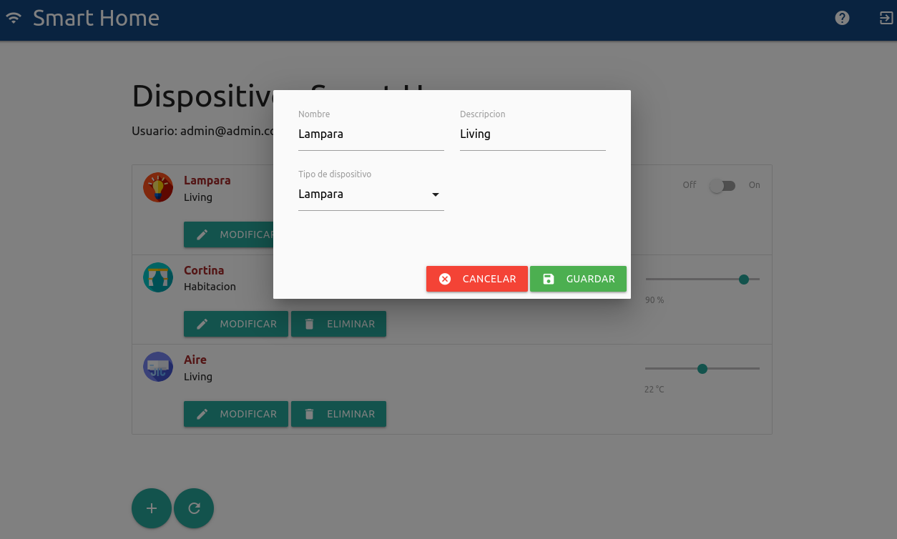

Luego, recibirás una notificación confirmando que la modificación se ha realizado con éxito:

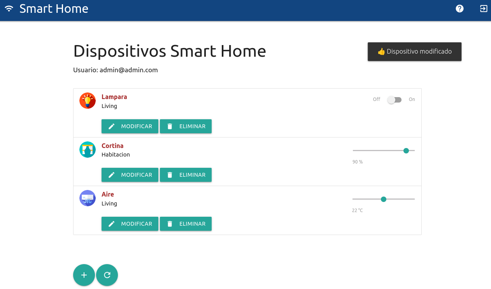

#### Refrescar lista de dispositivos 🔄

En la parte inferior, junto al botón `Agregar` dispositivos, encontrarás un botón `Refrescar`. Este botón es útil para actualizar los valores de los dispositivos.


### Backend 👨🏻‍💻

Elbackend proporciona una API con endpoints para realizar diversas funciones relacionadas con dispositivos y usuarios. La aplicación utiliza una base de datos para almacenar la información. A continuación, se detallan mas informacion sobre la estructura de la base de datos y endpoints disponibles:

#### Base de datos 💾:

1. Users:
    *   id: almacena el ID único de cada usuario.
    *   email: almacena la dirección de correo electrónico del usuario.
    *   password: almacena la contraseña del usuario.

> 👀 ¡Recuerda!: No se deben almacenar contraseñas directamente en la base de datos. Se recomienda utilizar técnicas de encriptación, como el hash y salt, para almacenar y verificar las contraseñas de forma segura.

2. Devices:
    *   id: almacena el ID único de cada dispositivo.
    *   name: almacena el nombre del dispositivo.
    *   description: almacena la descripción del dispositivo.
    *   state: almacena el estado actual del dispositivo.
    *   type: almacena el tipo de dispositivo (1 para Lampara, 2 para cortina, 3 para aire acondicionado).
    *   user_id: almacena el ID del usuario al que pertenece el dispositivo.

#### Endpoints ⚙️ :
A continuación se presentan los endpoints disponibles junto con sus descripciones:

<details><summary><b>Ver los endpoints disponibles</b></summary><br>

A continuación se listan los endpoints con los detalles de cada uno:

1. Obtener toda la lista de dispositivos y sus características de la base de datos:

    *   URL: http://localhost:8000/devices
    *   Método: GET
    *   Body: Ninguno
    *   Respuesta:
        *   Código de respuesta 200 - OK, junto con un JSON que contiene los dispositivos.
        *   Código de respuesta 400 - Error.
        
    Ejemplo de respuesta exitosa (código 200):
    ```json
        [
            {
                "id": 1,
                "name": "Lampara",
                "description": "Living",
                "state": 0,
                "type": 1,
                "user_id": 1
            },
            {
                "id": 2,
                "name": "Cortina",
                "description": "Habitacion",
                "state": 60,
                "type": 2,
                "user_id": 1
            },
            {
                "id": 3,
                "name": "Aire",
                "description": "Living",
                "state": 24,
                "type": 3,
                "user_id": 1
            },
            {
                "id": 4,
                "name": "Lampara",
                "description": "Cocina",
                "state": 1,
                "type": 1,
                "user_id": 2
            },
            {
                "id": 5,
                "name": "Cortina",
                "description": "Comedor",
                "state": 20,
                "type": 2,
                "user_id": 2
            },
            {
                "id": 6,
                "name": "Aire",
                "description": "Comedor",
                "state": 20,
                "type": 3,
                "user_id": 2
            }
        ]
    ```

2. Buscar un dispositivo en particular por medio de su id:
    *   URL: http://localhost:8000/devices/id
    *   Método: GET
    *   Body: Ninguno
    *   Respuesta:
        *   Código de respuesta 200 - OK, junto con un JSON que contiene el dispositivo solicitado.
        *   Código de respuesta 400 - Error.
        Ejemplo de respuesta exitosa (código 200):
        ```json
        [
            {
                "id": 4,
                "name": "Lampara",
                "description": "Cocina",
                "state": 1,
                "type": 1,
                "user_id": 2
            },
        ]
        ```
3. Obtener un dispositivo por su id:
    *   URL: http://localhost:8000/devices/:id
    *   Método: GET
    *   Body: Ninguno
    *   Respuesta:
        *   Código de respuesta 200 - OK, junto con un JSON que contiene el dispositivo solicitado.
        *   Código de respuesta 400 - Error.

4. Actualizar el estado de un dispositivo:
    *   URL:  http://localhost:8000/devices/state/:id
    *   Método: PUT
    *   Body: Estado actualizado del dispositivo.
    *   Respuesta:
        *   Código de respuesta 200 - OK, junto con un JSON que indica el número de filas modificadas.
        *   Código de respuesta 400 - Error.

5. Actualizar los detalles de un dispositivo:
    *   URL:  http://localhost:8000/devices/:id.
    *   Método: PUT
    *   Body: Nuevos detalles del dispositivo (nombre, descripción y tipo).
    *   Respuesta:
        *   Código de respuesta 200 - OK, junto con un JSON que indica el número de filas modificadas.
        *   Código de respuesta 400 - Error.

6.  Agregar un nuevo dispositivo:
    *   URL:  http://localhost:8000/devices/.
    *   Método: POST
    *   Body: Datos del nuevo dispositivo (nombre, descripción, estado, tipo y user_id).
    *   Respuesta:
        *   Código de respuesta 201 - Created, junto con un JSON que contiene el ID del dispositivo recién creado.
        *   Código de respuesta 400 - Error.

7.  Eliminar un dispositivo:
    *   URL:  http://localhost:8000/devices/:id
    *   Método: DELETE
    *   Body: Ninguno.
    *   Respuesta:
        *   Código de respuesta 200 - OK, junto con un mensaje que indica que el dispositivo ha sido eliminado.
        *   Código de respuesta 400 - Error.

8.  Iniciar sesión:
    *   URL:  http://localhost:8000/login
    *   Método: POST
    *   Body: Datos de inicio de sesión (email y contraseña).
    *   Respuesta:
        *   Código de respuesta 200 - OK, indica que el inicio de sesión fue exitoso.
        *   Código de respuesta 401 - Unauthorized, indica que ha ocurrido un error en el inicio de sesión. 

</details>

</details>


## Tecnologías utilizadas 🛠️

En esta sección podés ver las tecnologías más importantes utilizadas.

<details><summary><b>Mira la lista completa de tecnologías</b></summary><br>

* [Docker](https://www.docker.com/) - Ecosistema que permite la ejecución de contenedores de software.
* [Docker Compose](https://docs.docker.com/compose/) - Herramienta que permite administrar múltiples contenedores de Docker.
* [Node JS](https://nodejs.org/es/) - Motor de ejecución de código JavaScript en backend.
* [MySQL](https://www.mysql.com/) - Base de datos para consultar y almacenar datos.
* [PHPMyAdmin](https://www.phpmyadmin.net/) - Administrador web de base de datos.
* [Material Design](https://material.io/design) - Bibliotecas de estilo responsive para aplicaciones web.
* [TypeScript](https://www.typescriptlang.org/) - Superset de JavaScript tipado y con clases.

</details>

## Contribuir 🖇️

Si estás interesado en el proyecto y te gustaría sumar fuerzas para que siga creciendo y mejorando, podés abrir un hilo de discusión para charlar tus propuestas en [este link](https://github.com/gotoiot/app-fullstack-base/issues/new). Así mismo podés leer el archivo [Contribuir.md](https://github.com/gotoiot/gotoiot-doc/wiki/Contribuir) de nuestra Wiki donde están bien explicados los pasos para que puedas enviarnos pull requests.

## Sobre Goto IoT 📖

Goto IoT es una plataforma que publica material y proyectos de código abierto bien documentados junto a una comunidad libre que colabora y promueve el conocimiento sobre IoT entre sus miembros. Acá podés ver los links más importantes:

* **[Sitio web](https://www.gotoiot.com/):** Donde se publican los artículos y proyectos sobre IoT. 
* **[Github de Goto IoT:](https://github.com/gotoiot)** Donde están alojados los proyectos para descargar y utilizar. 
* **[Comunidad de Goto IoT:](https://groups.google.com/g/gotoiot)** Donde los miembros de la comunidad intercambian información e ideas, realizan consultas, solucionan problemas y comparten novedades.
* **[Twitter de Goto IoT:](https://twitter.com/gotoiot)** Donde se publican las novedades del sitio y temas relacionados con IoT.
* **[Wiki de Goto IoT:](https://github.com/gotoiot/doc/wiki)** Donde hay información de desarrollo complementaria para ampliar el contexto.

## Muestas de agradecimiento 🎁

Si te gustó este proyecto y quisieras apoyarlo, cualquiera de estas acciónes estaría más que bien para nosotros:

* Apoyar este proyecto con una ⭐ en Github para llegar a más personas.
* Sumarte a [nuestra comunidad](https://groups.google.com/g/gotoiot) abierta y dejar un feedback sobre qué te pareció el proyecto.
* [Seguirnos en twitter](https://github.com/gotoiot/doc/wiki) y dejar algún comentario o like.
* Compartir este proyecto con otras personas.

## Autores 👥

Las colaboraciones principales fueron realizadas por:

* **[Agustin Bassi](https://github.com/agustinBassi)**: Ideación, puesta en marcha y mantenimiento del proyecto.
* **[Ernesto Giggliotti](https://github.com/ernesto-g)**: Creación inicial del frontend, elección de Material Design.
* **[Brian Ducca](https://github.com/brianducca)**: Ayuda para conectar el backend a la base de datos, puesta a punto de imagen de Docker.

También podés mirar todas las personas que han participado en la [lista completa de contribuyentes](https://github.com/###/contributors).

## Licencia 📄

Este proyecto está bajo Licencia ([MIT](https://choosealicense.com/licenses/mit/)). Podés ver el archivo [LICENSE.md](LICENSE.md) para más detalles sobre el uso de este material.

---

**Copyright © Goto IoT 2021** ⌨️ [**Website**](https://www.gotoiot.com) ⌨️ [**Group**](https://groups.google.com/g/gotoiot) ⌨️ [**Github**](https://www.github.com/gotoiot) ⌨️ [**Twitter**](https://www.twitter.com/gotoiot) ⌨️ [**Wiki**](https://github.com/gotoiot/doc/wiki)
